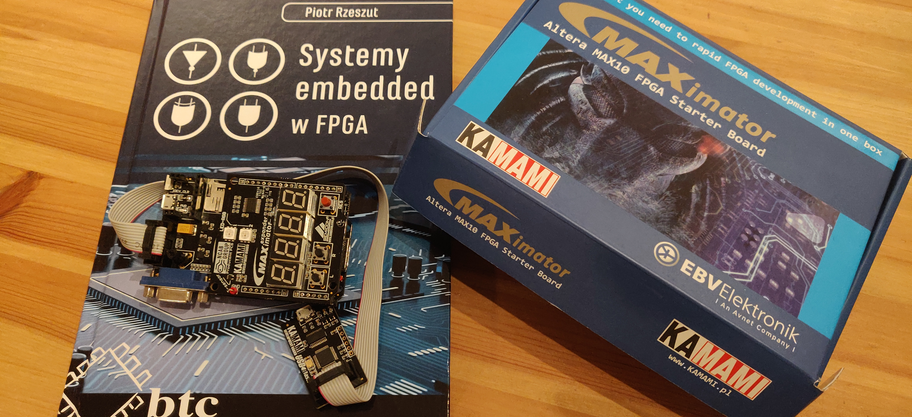

# EmbeddedSystemsInFPGA
Learning new skills in FPGA direction based on book "Systemy embedded w FPGA" written by Piotr Rzeszut. It can be translated to English as "Embedded systems in FPGA".

## Software
* Quartus
* Eclipse
* Platform Designer
* Pin Planner
* ModelSim-Intel FPGA Edition
* Signal Tap

## Hardware
MAXimator Altera MAX10 FPGA Starter Board

## Problems during tutorial
### *NIOSII Software Build Tools for Eclipse button doesn't trigger any program.
I needed to download NIOSII Software Build Tools for Eclipse from Intel website. This program is not included to the quartus installation.
### *Error: Failed to execute: wsl ./create-this-app –no-make
Solution is to download: [Windows Subsystem for Linux](https://docs.microsoft.com/en-us/windows/wsl/install-win10) and later by your Linux image wsl, make and dos2unix like:
'''
sudo apt update
sudo apt upgrade
sudo apt install wsl make dos2unix
'''
### *System ID not found/ system id parameter is not assigned automatically quartus
I'm still figuring this out
